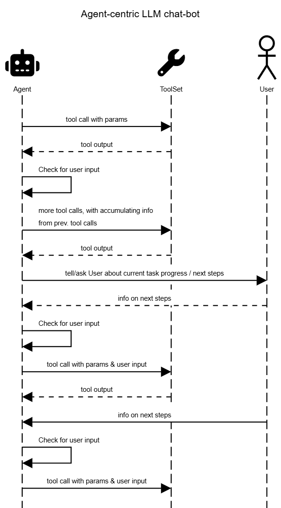

# Agent-centric LLM chat-bot pattern

LLM <-> User chat conversation is no longer at the center of the app's architecture; instead, the Agent <-> ToolSet interaction is.  
*Agent talks to User* (e.g. about task-completion process) is merely yet another tool in the agent's toolset.  
*User talks to Agent* happens by means of a secondary user-input thread, which the agent checks for new User messages before every tool call.

## Why?
The agent can loop/act independently "in the background", collecting and accumulating more information, utilizing it to work on more complex tasks/projects, or to better respond to future messages by the user in this conversation.

Ultimately, it is intended to use this logic to continuously  train/fine-tune the used LLM on topic-specific information (which is either web-searched or generated by the LLM itself).

## Usage
Please check the PoC branch for a PoC using Google Gemini. Put your GOOGLE_API_KEY into .env.
